# Alles A60/A70 Speaker Assembly
The Alles PCB can be fitted into the enclosure of an off-the-shelf Bluetooth speaker - either the [round A60](https://www.alibaba.com/product-detail/A60-Wooden-Grain-Portable-Wireless-Bluetooth_1600291216741.html?spm=a2700.wholesale.0.0.3e6c344biON4Qa) or the [square A70](https://www.alibaba.com/product-detail/A70-Wood-Speaker-Grain-Portable-Wireless_1600291333969.html). The Alles PCB replaces the original circuit board and keeps the speaker, battery, and buttons. Once installed, the USB port of the Alles PCB remains accessible and can be used to charge the battery. The speaker's buttons control the power, volume and WiFi mode (via the Play/Pause button). The result is a fully contained, battery-powered and rechargeable Alles speaker!  

## Suggested Tools

* A60/A70 Speaker (A60 used here)
* Alles PCB (Rev E used here)
* Soldering iron
* Flush cutters
* Fine flat-headed screwdriver, or a fine pointed tool that can fit in the speaker grill holes (0.8mm diameter screwdriver used here) 
* Small Phillips screwdriver (shaft no wider than 3.5mm diameter, and at least 22mm long)
* Wire strippers
* Helping hands
* Solder fume extractor

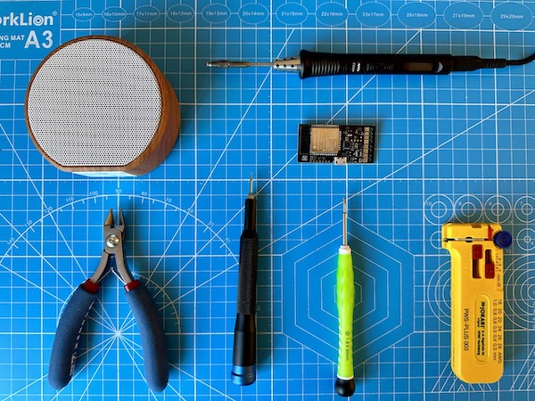

## Remove speaker grill
The metal grill is held in place by friction only. Use the small pointed tool to gradually work the edges of the grill loose, away from the plastic enclosure. Work your way around the speaker lifting the perimeter gradually to avoid bending the mesh out of shape. Under the grille is a paper filter - set this aside too. 

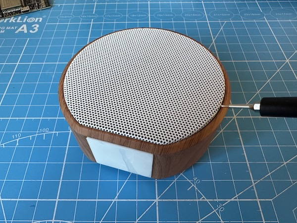

## Unscrew enclosure
Use the small Phillips screwdriver to remove the 4 screws that hold the back and front of the enclosure together. The screws are set fairly deep inside narrow mounting holes, needing a thin (<3.5mm diameter) and long (>20mm) screwdriver. Screwdriver sets with interchangeable tips are unlikely to work.

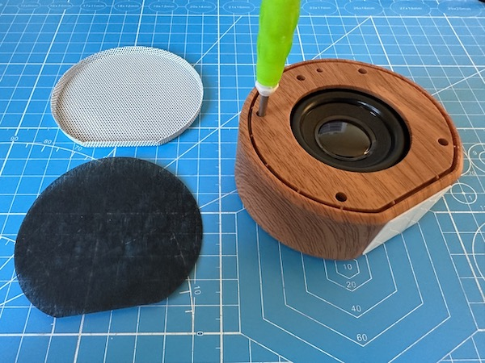

## Remove circuit board

Lift out circuit board and cut it free of the speaker and battery cables. Cut the cables close to where they are soldered to the PCB.

#### CAUTION: LIPO BATTERIES ARE DANGEROUS

When cutting the battery cables, cut them one a time to avoid shorting them with the wire cutter. Always make sure that there is no chance that red and black terminals can short at any time as this could permanently damage the battery and could even result in the battery catching fire.  

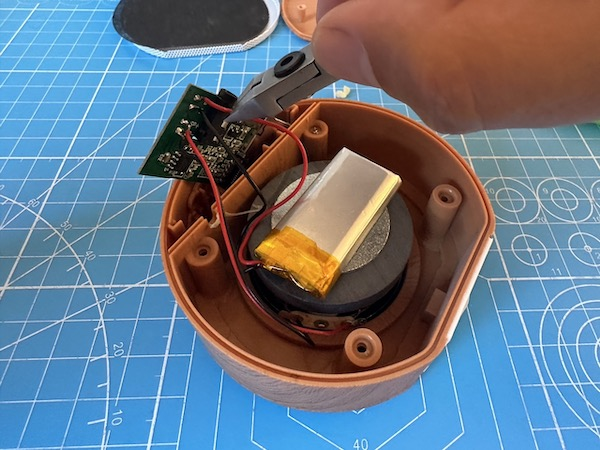
 
## Cut plastic ribs 

Use the flush cutters to trim the two ribs that supported the original PCB, which would interfere with the location of the ESP32 module in the Alles PCB. 

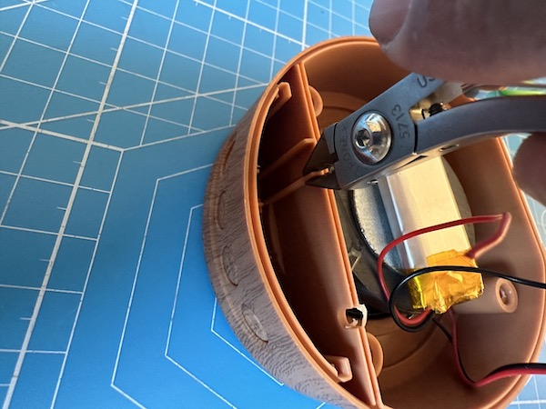

## Trim and tin wires

Strip, trim and tin with solder the battery and speaker wires. Leave about 2mm of tinned conductor exposed. Again, use caution when working on the battery wires - do one at a time, and make sure the other is safely isolated during the process so that they never come into contact and short the battery terminals.

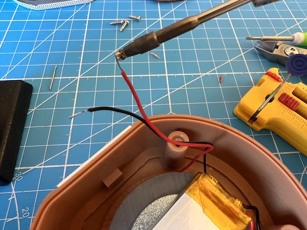

## Solder wires onto Alles PCB

Solder all four wires from the component-side of the Alles PCB. Make sure that the wire insulator is flush against the PCB solder point so that wires can safefly twist without risk of shorting.

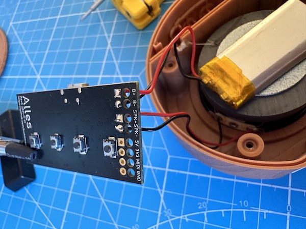

## Fit the Alles PCB into the enclosure

The Alles PCB should slide between two rails that hold the circuit board in place. The ReV E PCB used here is 0.3mm thicker than the speaker's original circuit board so getting it into the rails can be a tight fit. 

First, make sure that the plastic buttons are correctly in place by pushing their plungers from inside the enclosure. When the PCB is in place these plungers will contact the tact switches on the circuit board.

Align the PCB edges with the channels and firmly and gradually press the PCB into the grooves. Try to press down both sides simultaneous and avoid putting pressure on the USB connector.

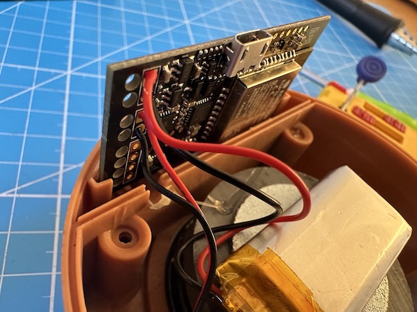

The PCB is fully in place when it is flush with the edge of the enclosure and the cables sit inside the slot. 

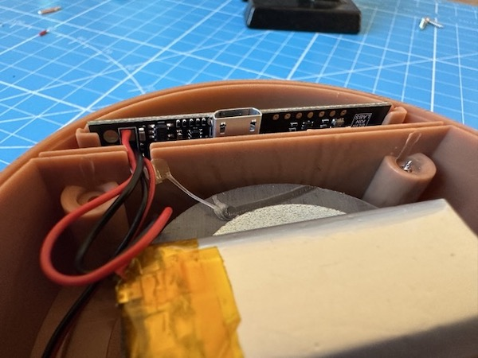

## Test fit and aligment

Test the fit and aligment by putting the back cover in place. The edges should sit flush with the edge of the enclosure, and the USB connector should be aligned with the opening on the cover. 

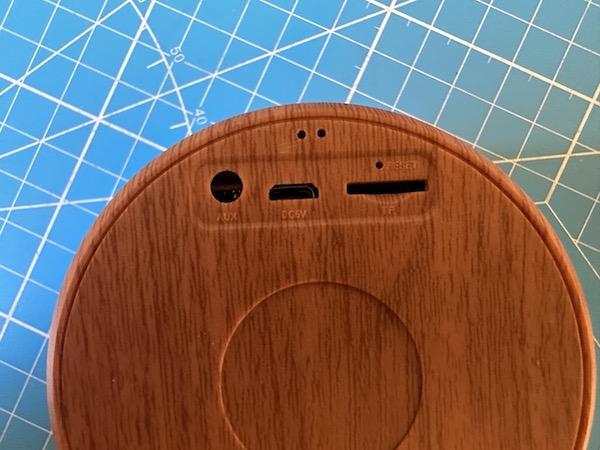

## Reassemble the speaker

Screw the enclosure together, replace the paper filter, and press the metal grill back into place. 

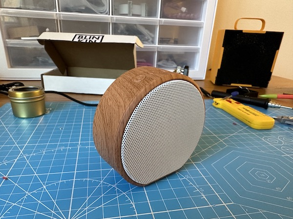
